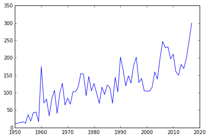

## 1. Introduction
<p>Everyone loves Lego (unless you ever stepped on one). Did you know by the way that "Lego" was derived from the Danish phrase leg godt, which means "play well"? Unless you speak Danish, probably not. </p>
<p>In this project, we will analyze a fascinating dataset on every single lego block that has ever been built!</p>

## 2. Reading Data
<p>A comprehensive database of lego blocks is provided by <a href="https://rebrickable.com/downloads/">Rebrickable</a>. The data is available as csv files and the schema is shown below.</p>
<p>Let us start by reading in the colors data to get a sense of the diversity of lego sets!</p>


```python
# Import modules
import pandas as pd

# Read colors data
colors = pd.read_csv('datasets/colors.csv')

# Print the first few rows
colors.head()
```


<div>
<table border="1" class="dataframe">
  <thead>
    <tr style="text-align: right;">
      <th></th>
      <th>id</th>
      <th>name</th>
      <th>rgb</th>
      <th>is_trans</th>
    </tr>
  </thead>
  <tbody>
    <tr>
      <th>0</th>
      <td>-1</td>
      <td>Unknown</td>
      <td>0033B2</td>
      <td>f</td>
    </tr>
    <tr>
      <th>1</th>
      <td>0</td>
      <td>Black</td>
      <td>05131D</td>
      <td>f</td>
    </tr>
    <tr>
      <th>2</th>
      <td>1</td>
      <td>Blue</td>
      <td>0055BF</td>
      <td>f</td>
    </tr>
    <tr>
      <th>3</th>
      <td>2</td>
      <td>Green</td>
      <td>237841</td>
      <td>f</td>
    </tr>
    <tr>
      <th>4</th>
      <td>3</td>
      <td>Dark Turquoise</td>
      <td>008F9B</td>
      <td>f</td>
    </tr>
  </tbody>
</table>
</div>


## 3. Exploring Colors
<p>Now that we have read the <code>colors</code> data, we can start exploring it! Let us start by understanding the number of colors available.</p>


```python
# How many distinct colors are available?
num_colors = colors['name'].nunique()
print(num_colors)
```

    135


## 4. Transparent Colors in Lego Sets
<p>The <code>colors</code> data has a column named <code>is_trans</code> that indicates whether a color is transparent or not. It would be interesting to explore the distribution of transparent vs. non-transparent colors.</p>


```python
# colors_summary: Distribution of colors based on transparency
colors['is_trans'] = colors['is_trans'].astype('category')
colors_summary = colors.pivot_table(index='is_trans', aggfunc='count')
print(colors_summary)
```

               id  name  rgb
    is_trans                
    f         107   107  107
    t          28    28   28


## 5. Explore Lego Sets
<p>Another interesting dataset available in this database is the <code>sets</code> data. It contains a comprehensive list of sets over the years and the number of parts that each of these sets contained. </p>
<p></p>
<p>Let us use this data to explore how the average number of parts in Lego sets has varied over the years.</p>


```python
%matplotlib inline
# Read sets data as `sets`
import matplotlib.pyplot as plt
sets = pd.read_csv('datasets/sets.csv')

# Create a summary of average number of parts by year: `parts_by_year`
parts_by_year = sets.pivot_table(index = 'year', aggfunc = 'mean').num_parts
# Plot trends in average number of parts by year
plt.plot(parts_by_year)

```


    [<matplotlib.lines.Line2D at 0x7fe6102b7da0>]





## 6. Lego Themes Over Years
<p>Lego blocks ship under multiple <a href="https://shop.lego.com/en-US/Themes">themes</a>. Let us try to get a sense of how the number of themes shipped has varied over the years.</p>


```python
# themes_by_year: Number of themes shipped by year
themes_by_year = sets[['year', 'theme_id']].groupby(by = 'year', as_index = False).\
    agg({'theme_id': 'count'})
print(themes_by_year)
```

        year  theme_id
    0   1950         7
    1   1953         4
    2   1954        14
    3   1955        28
    4   1956        12
    5   1957        21
    6   1958        42
    7   1959         4
    8   1960         3
    9   1961        17
    10  1962        40
    11  1963        18
    12  1964        11
    13  1965        10
    14  1966        89
    15  1967        21
    16  1968        25
    17  1969        69
    18  1970        29
    19  1971        45
    20  1972        38
    21  1973        68
    22  1974        39
    23  1975        31
    24  1976        68
    25  1977        92
    26  1978        73
    27  1979        82
    28  1980        88
    29  1981        79
    ..   ...       ...
    36  1988        68
    37  1989       114
    38  1990        85
    39  1991       106
    40  1992       115
    41  1993       111
    42  1994       128
    43  1995       128
    44  1996       144
    45  1997       194
    46  1998       325
    47  1999       300
    48  2000       327
    49  2001       339
    50  2002       447
    51  2003       415
    52  2004       371
    53  2005       330
    54  2006       283
    55  2007       319
    56  2008       349
    57  2009       403
    58  2010       444
    59  2011       502
    60  2012       615
    61  2013       593
    62  2014       715
    63  2015       670
    64  2016       609
    65  2017       470
    
    [66 rows x 2 columns]


## 7. Wrapping It All Up!
<p>Lego blocks offer an unlimited amount of fun across ages. We explored some interesting trends around colors, parts, and themes. </p>
